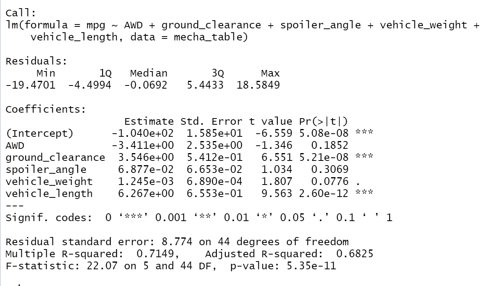
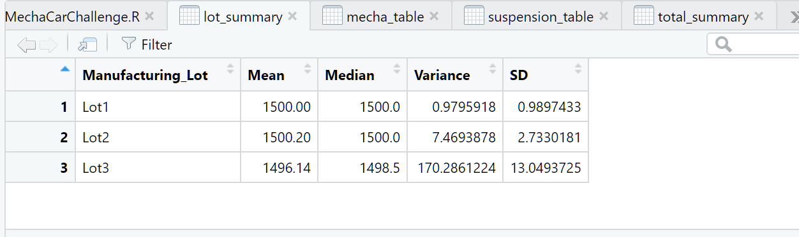
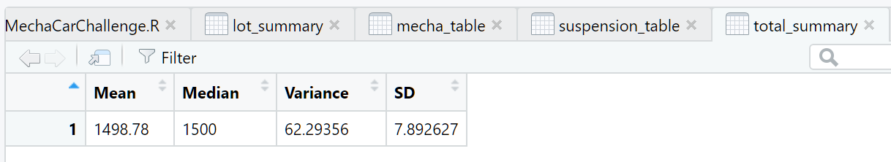
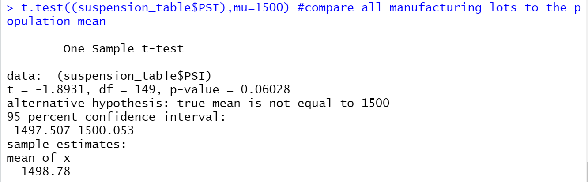
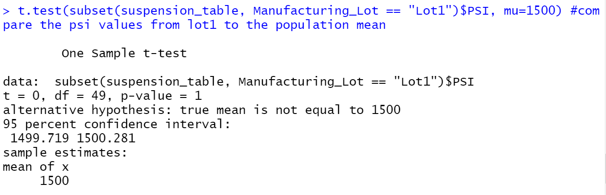
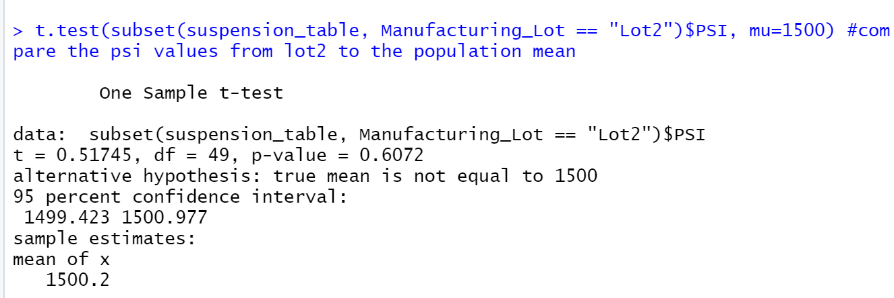
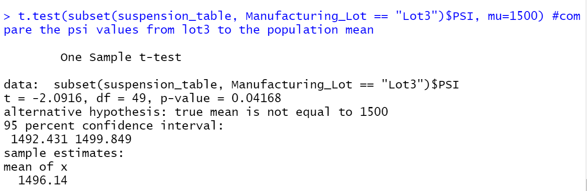

# MechaCar_Statistical_Analysis

## Overview
- Use R Script to perfom liner regression analysis an collect summary statistics. 
- Run T-Test to determine if the manufacturing lots are statistically different from the mean population

## Result

### Linear Regression to Predict MPG

The multiple liner regression model showes the vehicle length and ground clearance correlate strongly to fuel efficient. 
  

### Individual Lot Suspension Summary
- both lot 1 and 2 both variances doesn't exceed the design specification, and have similar means.  
- Lot 3 variance of 170.29 exceed the manufactures specification.
  

### Total Suspension Summary
The mean for the entire manufacture dataset is 1498.78 with the variance of 62.29 which does not exceed manufacture's specification
  

### T-Test
Run t-tests to determine if all manufacturing lots and each lot individually are statistically different from the population mean of 1,500 pounds per square inch.

#### T-Test all lots
  
#### T-Test each manufacturing lot
Lot 1
  
Lot 2
  
Lot 3
  

## Summary

- need more dataset from both competitor and MechaCar for testing for fuel efficient and horsepower. 
- dataset can include metrics for highway vs road fuel efficiecy
  